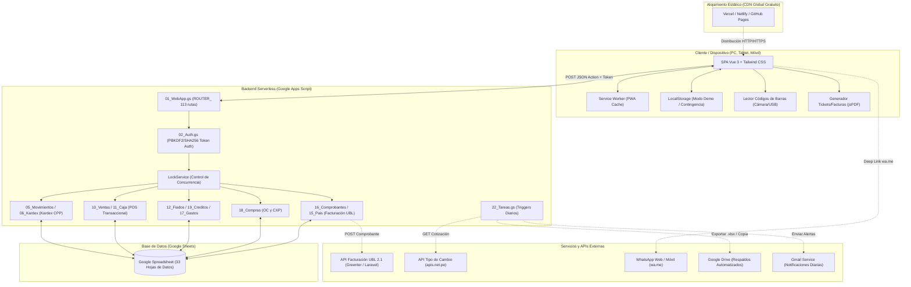
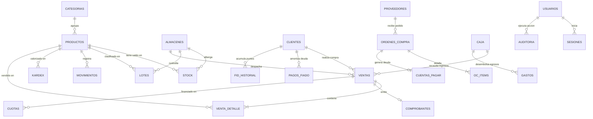
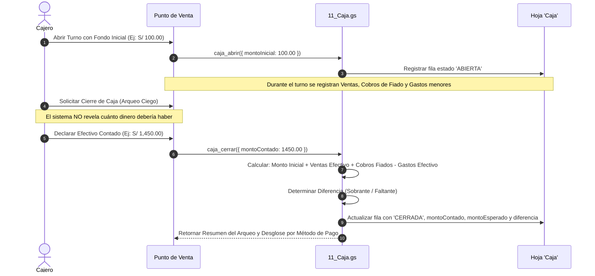
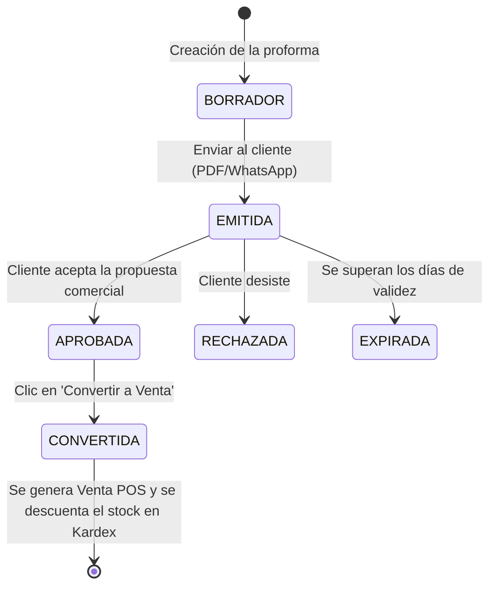

# MANUAL TÉCNICO Y GUÍA INTEGRAL DE ARQUITECTURA Y OPERACIÓN
# NexoERP & WMS — Versión 1.6.1

> **Documento Oficial de Referencia Técnica, Funcional y de Despliegue**  
> **Sistema Integrado de Gestión Empresarial (ERP) y Administración de Almacenes (WMS)**  
> **Pila Tecnológica:** Google Apps Script (Backend Serverless) + Google Sheets (Base de Datos Relacional) + Single Page Application (Vue 3 / Tailwind CSS) + PWA Offline.

---

## ÍNDICE GENERAL

1. [Resumen Ejecutivo y Filosofía de Arquitectura](#1-resumen-ejecutivo-y-filosofía-de-arquitectura)
   - 1.1 [Arquitectura de Costo Cero](#11-arquitectura-de-costo-cero)
   - 1.2 [Diagrama Global de Componentes](#12-diagrama-global-de-componentes)
   - 1.3 [Ciclo de Vida de una Petición (Request / Response)](#13-ciclo-de-vida-de-una-petición-request--response)
   - 1.4 [Motor Local de Contingencia (Modo Demo / Fallback Offline)](#14-motor-local-de-contingencia-modo-demo--fallback-offline)
2. [Modelo de Datos y Base de Datos Relacional (Google Sheets)](#2-modelo-de-datos-y-base-de-datos-relacional-google-sheets)
   - 2.1 [Diccionario Estructurado de las 33 Hojas](#21-diccionario-estructurado-de-las-33-hojas)
   - 2.2 [Manejo de Concurrencia y Bloqueos Atómicos (LockService)](#22-manejo-de-concurrencia-y-bloqueos-atómicos-lockservice)
   - 2.3 [Diagrama de Entidad-Relación Conceptual](#23-diagrama-de-entidad-relación-conceptual)
3. [Seguridad, Autenticación y Matriz de Roles (RBAC)](#3-seguridad-autenticación-y-matriz-de-roles-rbac)
   - 3.1 [Esquema de Hashing Criptográfico PBKDF2 / SHA-256 (Formato v2)](#31-esquema-de-hashing-criptográfico-pbkdf2--sha-256-formato-v2)
   - 3.2 [Gestión de Sesiones, Tokens UUID y Tiempo de Expiración (TTL)](#32-gestión-de-sesiones-tokens-uuid-y-tiempo-de-expiración-ttl)
   - 3.3 [Control Anti Fuerza Bruta y Rate Limiting](#33-control-anti-fuerza-bruta-y-rate-limiting)
   - 3.4 [Matriz de Roles y Permisos (RBAC)](#34-matriz-de-roles-y-permisos-rbac)
   - 3.5 [Pista de Auditoría Transaccional Inmutable](#35-pista-de-auditoría-transaccional-inmutable)
4. [El Núcleo WMS: Gestión de Almacenes, Stock y Kardex](#4-el-núcleo-wms-gestión-de-almacenes-stock-y-kardex)
   - 4.1 [Tipos de Movimientos de Inventario](#41-tipos-de-movimientos-de-inventario)
   - 4.2 [Algoritmo de Kardex Valorizado: Costo Promedio Ponderado (CPP)](#42-algoritmo-de-kardex-valorizado-costo-promedio-ponderado-cpp)
   - 4.3 [Control Multi-Almacén y Transferencias](#43-control-multi-almacén-y-transferencias)
   - 4.4 [Política de Stock Negativo y Bloqueo Atómico](#44-política-de-stock-negativo-y-bloqueo-atómico)
   - 4.5 [Trazabilidad de Lotes, Vencimientos y Números de Serie](#45-trazabilidad-de-lotes-vencimientos-y-números-de-serie)
   - 4.6 [Fraccionamiento de Unidades y Factores de Conversión](#46-fraccionamiento-de-unidades-y-factores-de-conversión)
5. [Punto de Venta (POS) y Gestión Integral de Caja](#5-punto-de-venta-pos-y-gestión-integral-de-caja)
   - 5.1 [Terminal de Ventas de Alta Velocidad](#51-terminal-de-ventas-de-alta-velocidad)
   - 5.2 [Políticas de Descuento, Precios Mínimos y Regalos con Autorización](#52-políticas-de-descuento-precios-mínimos-y-regalos-con-autorización)
   - 5.3 [Ventas en Espera (Borradores POS)](#53-ventas-en-espera-borradores-pos)
   - 5.4 [Ciclo Integral de Caja: Apertura, Arqueo Ciego y Cierre](#54-ciclo-integral-de-caja-apertura-arqueo-ciego-y-cierre)
   - 5.5 [Emisión e Impresión de Tickets Térmicos (80mm / 58mm / PDF)](#55-emisión-e-impresión-de-tickets-térmicos-80mm--58mm--pdf)
6. [Créditos, Fiados y Cobranzas Activas (CXC)](#6-créditos-fiados-y-cobranzas-activas-cxc)
   - 6.1 [Fiados de Confianza y Límite de Crédito](#61-fiados-de-confianza-y-límite-de-crédito)
   - 6.2 [Ventas a Crédito Formales con Cronograma de Cuotas](#62-ventas-a-crédito-formales-con-cronograma-de-cuotas)
   - 6.3 [Reporte de Antigüedad de Deuda (Aging)](#63-reporte-de-antigüedad-de-deuda-aging)
   - 6.4 [Cobranza Automatizada vía WhatsApp](#64-cobranza-automatizada-vía-whatsapp)
7. [Cotizaciones y Proformas Comerciales](#7-cotizaciones-y-proformas-comerciales)
   - 7.1 [Ciclo de Estados de una Cotización](#71-ciclo-de-estados-de-una-cotización)
   - 7.2 [Conversión Atómica en 1 Clic a Venta POS](#72-conversión-atómica-en-1-clic-a-venta-pos)
   - 7.3 [Exportación Profesional a PDF](#73-exportación-profesional-a-pdf)
8. [Compras, Órdenes de Compra y Cuentas por Pagar (CXP)](#8-compras-órdenes-de-compra-y-cuentas-por-pagar-cxp)
   - 8.1 [Flujo de Aprovisionamiento y Cotizaciones de Proveedores](#81-flujo-de-aprovisionamiento-y-cotizaciones-de-proveedores)
   - 8.2 [Recepción de Mercadería e Impacto Inmediato en Kardex](#82-recepción-de-mercadería-e-impacto-inmediato-en-kardex)
   - 8.3 [Gestión de Cuentas por Pagar (CXP)](#83-gestión-de-cuentas-por-pagar-cxp)
9. [Facturación Electrónica SUNAT y Localización Multi-País](#9-facturación-electrónica-sunat-y-localización-multi-país)
   - 9.1 [Motor de Localización Regional para 8 Países](#91-motor-de-localización-regional-para-8-países)
   - 9.2 [Series Electrónicas Oficiales (B001, F001, FC01, FD01)](#92-series-electrónicas-oficiales-b001-f001-fc01-fd01)
   - 9.3 [Integración UBL 2.1 con APIs de Facturación (Greenter / Laravel)](#93-integración-ubl-21-con-apis-de-facturación-greenter--laravel)
   - 9.4 [Generación de Libro Electrónico PLE 14.1 (Registro de Ventas)](#94-generación-de-libro-electrónico-ple-141-registro-de-ventas)
   - 9.5 [Sincronización en Vivo de Tipo de Cambio USD](#95-sincronización-en-vivo-de-tipo-de-cambio-usd)
10. [Analítica de Negocio y Business Intelligence](#10-analítica-de-negocio-y-business-intelligence)
    - 10.1 [Clasificación ABC de Inventario (Curva de Pareto 80/15/5)](#101-clasificación-abc-de-inventario-curva-de-pareto-80155)
    - 10.2 [Detección de Inventario Muerto y Capital Inmovilizado](#102-detección-de-inventario-muerto-y-capital-inmovilizado)
    - 10.3 [Análisis de Margen y Rentabilidad Real](#103-análisis-de-margen-y-rentabilidad-real)
    - 10.4 [Dashboard Ejecutivo en Tiempo Real](#104-dashboard-ejecutivo-en-tiempo-real)
11. [Módulos Auxiliares: Fidelización, RRHH y Gastos](#11-módulos-auxiliares-fidelización-rrhh-y-gastos)
    - 11.1 [Programa de Fidelización y Puntos de Clientes](#111-programa-de-fidelización-y-puntos-de-clientes)
    - 11.2 [Control de Asistencia del Personal](#112-control-de-asistencia-del-personal)
    - 11.3 [Liquidación de Comisiones de Venta](#113-liquidación-de-comisiones-de-venta)
    - 11.4 [Control de Gastos Operativos y Caja Chica](#114-control-de-gastos-operativos-y-caja-chica)
12. [Automatizaciones y Tareas en Segundo Plano (Triggers)](#12-automatizaciones-y-tareas-en-segundo-plano-triggers)
    - 12.1 [Tarea Diaria: Auditoría Preventiva y Notificaciones por Correo](#121-tarea-diaria-auditoría-preventiva-y-notificaciones-por-correo)
    - 12.2 [Copia de Respaldo Automatizada en Google Drive](#122-copia-de-respaldo-automatizada-en-google-drive)
    - 12.3 [Sincronización Automática de Divisas](#123-sincronización-automática-de-divisas)
13. [Catálogo Público Web y Pedidos por WhatsApp](#13-catálogo-público-web-y-pedidos-por-whatsapp)
    - 13.1 [Arquitectura del Endpoint Público Seguro](#131-arquitectura-del-endpoint-público-seguro)
    - 13.2 [Portal Web Móvil (catalogo.html)](#132-portal-web-móvil-catalogohtml)
    - 13.3 [Generación Dinámica del Mensaje de WhatsApp](#133-generación-dinámica-del-mensaje-de-whatsapp)
14. [Frontend SPA, Componentes y Capacidad Offline (PWA)](#14-frontend-spa-componentes-y-capacidad-offline-pwa)
    - 14.1 [Estructura Modular de Vistas y Componentes Vue 3](#141-estructura-modular-de-vistas-y-componentes-vue-3)
    - 14.2 [Estrategia de Caché y Service Worker (sw.js)](#142-estrategia-de-caché-y-service-worker-swjs)
    - 14.3 [Resiliencia de Red y Sincronización Diferida](#143-resiliencia-de-red-y-sincronización-diferida)
15. [Diccionario Exhaustivo de la API (113 Acciones)](#15-diccionario-exhaustivo-de-la-api-113-acciones)
16. [Guía de Instalación, Configuración y Despliegue Paso a Paso](#16-guía-de-instalación-configuración-y-despliegue-paso-a-paso)
    - 16.1 [Paso 1: Preparación de la Hoja de Google Sheets](#161-paso-1-preparación-de-la-hoja-de-google-sheets)
    - 16.2 [Paso 2: Instalación del Backend en Google Apps Script](#162-paso-2-instalación-del-backend-en-google-apps-script)
    - 16.3 [Paso 3: Despliegue de la API Web App](#163-paso-3-despliegue-de-la-api-web-app)
    - 16.4 [Paso 4: Despliegue del Frontend (Vercel / Hosting Estático)](#164-paso-4-despliegue-del-frontend-vercel--hosting-estático)
    - 16.5 [Paso 5: Asistente de Configuración Inicial (Wizard)](#165-paso-5-asistente-de-configuración-inicial-wizard)
17. [Solución de Problemas (Troubleshooting) y Mantenimiento](#17-solución-de-problemas-troubleshooting-y-mantenimiento)
    - 17.1 [Diagnóstico Rápido de Errores Comunes](#171-diagnóstico-rápido-de-errores-comunes)
    - 17.2 [Límites y Cuotas de Google Apps Script](#172-límites-y-cuotas-de-google-apps-script)
    - 17.3 [Buenas Prácticas Operativas y Mantenimiento Preventivo](#173-buenas-prácticas-operativas-y-mantenimiento-preventivo)

---


## 1. Resumen Ejecutivo y Filosofía de Arquitectura

### 1.1 Arquitectura de Costo Cero

**NexoERP v1.6.1** es una plataforma integral de gestión comercial (ERP) y administración avanzada de almacenes (WMS), concebida bajo el paradigma de **arquitectura serverless de costo cero recurrente**. El sistema elimina por completo la necesidad de contratar servidores dedicados (VPS), bases de datos administradas (MySQL/PostgreSQL), balanceadores de carga o certificaciones SSL pagadas.

La arquitectura se compone de cuatro pilares desacoplados:

1. **Frontend Single Page Application (SPA):** Construido sobre Vue 3 y estilizado con utilidades de Tailwind CSS. Se aloja como contenido estático puro (HTML, CSS, JS) en servicios globales CDN gratuitos como Vercel, Netlify, Cloudflare Pages o GitHub Pages.
2. **Backend Serverless (Google Apps Script - GAS):** Actúa como el motor de lógica de negocio y API REST/RPC. Procesa las solicitudes mediante puntos de entrada `doGet` y `doPost`, resolviendo enrutamiento, validación criptográfica de sesiones, reglas de inventario y permisos por rol.
3. **Capa de Persistencia Relacional Emulada (Google Sheets):** Una hoja de cálculo de Google Drive actúa como la base de datos central. Cada entidad del sistema representa una pestaña (`Sheet`) con encabezados tipificados en la fila 1 y registros en las filas subsiguientes, garantizando respaldo automático, auditoría visual inmediata y exportabilidad nativa a formatos Excel/PDF.
4. **Capa de Resiliencia y Ejecución Offline (PWA):** Un Service Worker (`sw.js`) intercepta peticiones de red, almacena en caché la shell de la aplicación y permite que el Punto de Venta (POS) continúe emitiendo tickets en contingencia sin conexión a Internet, sincronizando transacciones diferidas al restaurarse el enlace.

### 1.2 Diagrama Global de Componentes



### 1.3 Ciclo de Vida de una Petición (Request / Response)

Toda comunicación entre el frontend y el backend se realiza mediante llamadas HTTP POST codificadas en JSON hacia la URL de despliegue de Google Apps Script (`API_URL`).

El ciclo de ejecución es el siguiente:
1. **Emisión de la llamada:** La función cliente `llamar(accion, params)` (`api.js`) extrae el token de autenticación del estado activo (`store.token`) y realiza una petición `fetch(API_URL, { method: 'POST', body: JSON.stringify({ action: accion, token: token, ...params }) })`.
2. **Punto de Entrada GAS (`01_WebApp.gs`):**
   - Se recibe la función `doPost(e)`.
   - Se procesan las cabeceras CORS para permitir la interacción desde cualquier dominio (`Access-Control-Allow-Origin: *`).
   - Se parsea el cuerpo de la petición: `var body = JSON.parse(e.postData.contents)`.
3. **Validación de Identidad y Sesión (`02_Auth.gs`):**
   - A excepción de acciones públicas (`login`, `ping`, `setup_inicial`, `catalogo_publico`), el backend busca el token en la pestaña `Sesiones`.
   - Comprueba que el registro exista, que el estado sea válido y que `expira > new Date()`.
   - Extrae el usuario y el rol del operador (`admin`, `gerente`, `operador`, `cajero`, etc.).
4. **Verificación de Permisos (RBAC):**
   - El enrutador consulta la matriz de permisos `APP.PERMISOS` (`00_Config.gs`). Si la acción requiere privilegios especiales (ej. `movimientos:anular`), valida que el rol del usuario figure en la lista autorizada.
5. **Control de Concurrencia (LockService):**
   - En operaciones transaccionales críticas (registro de ventas, movimientos de almacén, aperturas de caja, recepciones de compra), se invoca `LockService.getScriptLock().waitLock(30000)`. Esto congela ejecuciones simultáneas evitando colisiones de stock y duplicidad de correlativos.
6. **Ejecución del Controlador de Negocio:**
   - La acción se despacha al método correspondiente en el backend (ej. `ventaGuardar_`, `movimientoRegistrar_`, etc.).
   - Se leen y actualizan las hojas de Google Sheets usando las funciones atómicas de `03_Db.gs`.
7. **Respuesta Estandarizada:**
   - Si la operación es exitosa, retorna: `{ ok: true, data: ..., error: null, code: null }`.
   - Si ocurre una excepción controlada, retorna: `{ ok: false, data: null, error: 'Mensaje descriptivo', code: 'CODIGO_ERROR' }`.
   - Se formatea la salida mediante `ContentService.createTextOutput(JSON.stringify(res)).setMimeType(ContentService.MimeType.JSON)`.

### 1.4 Motor Local de Contingencia (Modo Demo / Fallback Offline)

NexoERP incluye una suite de contingencia integral gobernada por `demo-store.js` y `demo-data.js`.
- Si el usuario ejecuta la aplicación sin configurar una URL de API (`CONFIG_APP.API_URL = ''`), el cliente no arroja error: conmuta automáticamente al **Motor Local**.
- `demo-store.js` implementa en memoria y sincroniza en `localStorage` **las 113 rutas completas del backend**.
- Simula fielmente el cálculo de saldos de kardex por costo promedio ponderado, el control de stock mínimo, la emisión de boletas/facturas, la apertura/cierre de turnos de caja y el módulo de cobranzas.
- Permite demostraciones comerciales instantáneas y sirve de entorno de pruebas y capacitación sin alterar la base de datos productiva de la empresa.

## 2. Modelo de Datos y Base de Datos Relacional (Google Sheets)

### 2.1 Diccionario Estructurado de las 33 Hojas

El sistema organiza la persistencia de datos en 33 pestañas claramente tipificadas dentro de un único archivo de Google Sheets. Cada hoja posee un encabezado fijo en la fila 1 y tipos de datos predefinidos:

| N° | Hoja (Pestaña) | Propósito Funcional | Columnas (Encabezados Fila 1) |
|---|---|---|---|
| 1 | **Config** | Parámetros globales clave-valor de la empresa, divisas, impuestos y políticas. | `clave`, `valor` |
| 2 | **Usuarios** | Credenciales de acceso, nombres, roles del sistema, salts criptográficos y hashes de contraseñas. | `id`, `usuario`, `nombre`, `rol`, `salt`, `hash`, `estado`, `ultimoAcceso`, `creado` |
| 3 | **Sesiones** | Registro de tokens activos emitidos tras el login para control de accesos con expiración (TTL). | `token`, `usuarioId`, `rol`, `creado`, `expira` |
| 4 | **Categorias** | Clasificación taxonómica de los productos del inventario. | `id`, `nombre`, `descripcion`, `estado` |
| 5 | **Almacenes** | Sedes físicas, sucursales, bodegas de despacho o almacenes centrales. | `id`, `codigo`, `nombre`, `direccion`, `responsable`, `estado` |
| 6 | **Productos** | Catálogo maestro de artículos, SKUs, precios minoristas/mayoristas, stock de seguridad y banderas de control. | `id`, `sku`, `nombre`, `descripcion`, `categoria`, `unidad`, `costoStd`, `precioVenta`, `precioMinimo`, `stockMin`, `stockMax`, `requiereLote`, `requiereSerie`, `perecedero`, `estado`, `creado` |
| 7 | **Stock** | Matriz de saldos de existencias consolidadas por producto y almacén. | `productoId`, `almacenId`, `cantidad` |
| 8 | **Lotes** | Trazabilidad de lotes de producción/adquisición, fechas de caducidad y series unitarias. | `id`, `productoId`, `almacenId`, `lote`, `numeroSerie`, `fechaVencimiento`, `cantidad`, `estado` |
| 9 | **Proveedores** | Directorio de personas jurídicas y naturales que abastecen de mercadería al negocio. | `id`, `ruc`, `razonSocial`, `contacto`, `telefono`, `email`, `direccion`, `estado` |
| 10 | **Clientes** | Registro de clientes, identificación tributaria (DNI/RUC), teléfonos, límites de fiado y saldo deudor. | `id`, `documento`, `razonSocial`, `contacto`, `telefono`, `email`, `direccion`, `estado`, `limiteFiado`, `saldoFiado` |
| 11 | **Movimientos** | Registro transaccional inmutable de todo ingreso, egreso, traspaso o ajuste de mercadería (Kardex físico). | `id`, `fecha`, `tipo`, `productoId`, `almacenOrigenId`, `almacenDestinoId`, `cantidad`, `costoUnitario`, `lote`, `numeroSerie`, `fechaVencimiento`, `documentoRef`, `motivo`, `observaciones`, `usuario`, `estado`, `anuladoMotivo` |
| 12 | **Kardex** | Libro de control de inventario permanente valorizado bajo el método Costo Promedio Ponderado (CPP). | `id`, `fecha`, `productoId`, `almacenId`, `movimientoId`, `tipo`, `entradaCantidad`, `entradaValor`, `salidaCantidad`, `salidaValor`, `saldoCantidad`, `saldoValor`, `costoPromedio`, `documentoRef`, `usuario` |
| 13 | **Auditoria** | Bitácora de seguridad con todas las acciones críticas ejecutadas en el sistema. | `id`, `fecha`, `usuarioId`, `usuario`, `rol`, `accion`, `detalle` |
| 14 | **Numeracion** | Control y bloqueo de correlativos para la emisión secuencial de comprobantes y órdenes. | `tipo`, `prefijo`, `correlativo` |
| 15 | **Ventas** | Cabecera de transacciones comerciales emitidas por el Punto de Venta (POS) o por pedidos. | `id`, `boleta`, `fecha`, `clienteId`, `clienteDocTipo`, `clienteDocNumero`, `clienteNombre`, `clienteTelefono`, `subtotal`, `igv`, `total`, `descuentoTotal`, `metodoPago`, `montoRecibido`, `vuelto`, `almacenId`, `usuario`, `autorizadoPor`, `estado`, `anuladoMotivo`, `estadoPago`, `enviadoWhatsapp` |
| 16 | **VentaDetalle** | Líneas de artículos asociadas a cada venta (cantidades, precios, descuentos y costos al momento de la venta). | `id`, `ventaId`, `productoId`, `sku`, `descripcion`, `cantidad`, `precioUnit`, `precioOriginal`, `esRegalo`, `descuento`, `costoUnit`, `subtotal`, `movimientoId`, `lote` |
| 17 | **Caja** | Control de aperturas, arqueos ciegos y cierres de turnos de los cajeros. | `id`, `fecha`, `aperturaAt`, `usuario`, `montoInicial`, `cierreAt`, `montoSistema`, `montoContado`, `diferencia`, `estado`, `detalle` |
| 18 | **PagosFiado** | Historial de amortizaciones y cancelaciones de deudas de clientes que compraron al fiado. | `id`, `fecha`, `clienteId`, `clienteNombre`, `ventaId`, `monto`, `metodoPago`, `usuario`, `nota` |
| 19 | **Cotizaciones** | Presupuestos y proformas comerciales emitidas con plazo de vigencia. | `id`, `numero`, `fecha`, `clienteId`, `clienteDocTipo`, `clienteDocNumero`, `clienteNombre`, `clienteTelefono`, `subtotal`, `igv`, `total`, `validezHasta`, `validezDias`, `estado`, `usuario`, `convertidoA`, `nota` |
| 20 | **CotizacionDetalle** | Líneas de productos y servicios presupuestados en una cotización. | `id`, `cotizacionId`, `productoId`, `sku`, `descripcion`, `cantidad`, `precioUnit`, `esRegalo`, `subtotal` |
| 21 | **Comprobantes** | Facturas, boletas electrónicas, notas de crédito y débito estructuradas para SUNAT / APIs UBL 2.1. | `id`, `ventaId`, `tipo`, `serie`, `correlativo`, `numero`, `fecha`, `clienteDocTipo`, `clienteDocNumero`, `clienteNombre`, `moneda`, `subtotal`, `igv`, `total`, `modoEnvio`, `estado`, `sunatId`, `cdrCodigo`, `cdrDescripcion`, `apiDocId`, `respuesta`, `payload`, `observaciones`, `usuario`, `creado` |
| 22 | **Cuotas** | Cronograma de amortización para ventas financiadas a plazos. | `id`, `ventaId`, `clienteId`, `clienteNombre`, `nCuota`, `totalCuotas`, `fechaVenc`, `monto`, `saldo`, `estado`, `pagadoAt`, `metodoPago`, `usuario`, `observaciones` |
| 23 | **Gastos** | Egresos operativos y extracciones de caja chica del negocio. | `id`, `fecha`, `categoria`, `descripcion`, `monto`, `metodoPago`, `numeroDoc`, `usuario`, `estado`, `creado` |
| 24 | **GastosCategorias** | Catálogo de tipos de gastos (servicios, suministros, alquileres, salarios). | `id`, `nombre`, `tipo`, `estado` |
| 25 | **OrdenesCompra** | Órdenes de compra generadas a proveedores con condiciones y estado de entrega. | `id`, `numero`, `proveedorId`, `proveedorNombre`, `fecha`, `fechaEsperada`, `estado`, `condicionPago`, `diasCredito`, `moneda`, `subtotal`, `igv`, `total`, `observaciones`, `usuario`, `creado` |
| 26 | **OcItems** | Detalle de artículos pedidos y cantidades recepcionadas en órdenes de compra. | `id`, `ocId`, `productoId`, `sku`, `descripcion`, `unidad`, `cantidadPedida`, `cantidadRecibida`, `costoUnit` |
| 27 | **OcOfertas** | Cotizaciones comparativas recibidas de diversos proveedores para una misma orden. | `id`, `ocId`, `proveedorNombre`, `costoTotal`, `plazoDias`, `comentario`, `elegida` |
| 28 | **CuentasPagar** | Obligaciones financieras y cronograma de pagos a proveedores derivados de compras. | `id`, `ocId`, `numero`, `proveedorId`, `proveedorNombre`, `fecha`, `fechaVenc`, `monto`, `saldo`, `estado`, `pagadoAt`, `metodoPago`, `usuario` |
| 29 | **Notificaciones** | Registro de alertas y avisos generados por el sistema para la administración. | `id`, `fecha`, `clave`, `tipo`, `severidad`, `titulo`, `mensaje`, `referencia`, `leido` |
| 30 | **Asistencia** | Marcación de ingresos y salidas del personal operativo con conteo de horas. | `id`, `fecha`, `usuarioId`, `usuario`, `entrada`, `salida`, `minutos`, `nota`, `estado` |
| 31 | **Vendedores** | Configuración de comisiones porcentuales asignadas a los agentes comerciales. | `id`, `usuarioId`, `usuario`, `comisionPct`, `estado` |
| 32 | **FidHistorial** | Registro transaccional de puntos acumulados y canjeados por los clientes en el POS. | `id`, `fecha`, `clienteId`, `clienteNombre`, `tipo`, `puntos`, `ventaId`, `nota`, `usuario`, `saldoDespues` |
| 33 | **Presupuesto** | Asignación y control de techos presupuestarios mensuales por categoría de gasto. | `id`, `mes`, `categoria`, `monto`, `actualizadoAt` |

### 2.2 Manejo de Concurrencia y Bloqueos Atómicos (LockService)

Dado que Google Sheets no ofrece aislamiento de transacciones ACID nativo (como `BEGIN TRANSACTION` / `COMMIT`), NexoERP implementa el mecanismo **ScriptLock** provisto por el entorno de Google Apps Script (`LockService.getScriptLock()`).

Cuando un proceso crítico es disparado:
```javascript
var lock = LockService.getScriptLock();
try {
  // Espera hasta 30 segundos por el candado exclusivo
  lock.waitLock(30000); 

  // Lectura fresca de datos, validación de stock y actualización
  ...
  SpreadsheetApp.flush(); // Forzado de escritura síncrona en Sheets
} finally {
  lock.releaseLock(); // Liberación garantizada del candado
}
```

Este mecanismo previene de manera absoluta:
1. **Condiciones de Carrera en Stock:** Dos cajeros vendiendo la última unidad disponible en simultáneo. El segundo cajero es encolado; cuando su petición entra, la lectura atómica detecta stock en 0 y rechaza la venta con `STOCK_INSUFICIENTE`.
2. **Duplicidad de Correlativos:** Generación de boletas o facturas con números duplicados. La lectura del último correlativo y su incremento en la hoja `Numeracion` es estrictamente serial.

### 2.3 Diagrama de Entidad-Relación Conceptual



## 3. Seguridad, Autenticación y Matriz de Roles (RBAC)

### 3.1 Esquema de Hashing Criptográfico PBKDF2 / SHA-256 (Formato v2)

La seguridad de las credenciales de los usuarios en NexoERP v1.6.1 utiliza un estándar de estiramiento de clave (Key Stretching) de grado criptográfico, implementado en `02_Auth.gs`:

1. **Estructura del Hash v2:** Cada contraseña se almacena bajo el formato:
   ```text
   sha256:10000:<salt_hex>:<hash_hex>
   ```
2. **Generación de Sal (Salt):** Se genera un vector aleatorio de 16 bytes mediante `Utilities.computeHmacSha256Signature` derivado de fuentes de entropía del sistema (`Date.now()`, números aleatorios y UUIDs de sesión).
3. **Función de Derivación (PBKDF2):** Se ejecutan **10,000 iteraciones** sucesivas de HMAC-SHA256 encadenando el resultado previo para computar el hash final. Esto neutraliza de raíz los ataques mediante tablas de arcoíris (Rainbow Tables) o ataques por fuerza bruta con hardware acelerado (GPU/ASIC).
4. **Retrocompatibilidad Automática:** El sistema mantiene compatibilidad con contraseñas en formato v1 (`sha256:salt:hash`). Al autenticar a un usuario con credencial v1 válida, el backend actualiza de forma transparente su registro al formato v2 con 10,000 iteraciones.

### 3.2 Gestión de Sesiones, Tokens UUID y Tiempo de Expiración (TTL)

- **Emisión de Tokens:** Tras un inicio de sesión exitoso mediante la acción `login`, el backend genera un token opaco aleatorio (UUIDv4) y lo inserta en la hoja `Sesiones`.
- **Tiempo de Vida (TTL):** La constante `APP.TOKEN_TTL_HORAS` define una vigencia por defecto de **8 horas**.
- **Validación en Cada Solicitud:** Cada endpoint protegido extrae el token enviado por el cliente en el cuerpo JSON (`token` o `auth_token`) y valida que:
  - Exista en la pestaña `Sesiones`.
  - La fecha actual no sobrepase la columna `expira`.
- **Cierre de Sesión:** La acción `logout` purga inmediatamente el registro de la hoja `Sesiones`, invalidando el token de forma instantánea.

### 3.3 Control Anti Fuerza Bruta y Rate Limiting

Para salvaguardar las cuentas contra ataques automatizados de adivinación de credenciales:
- El backend mantiene en memoria y en propiedades del script un contador de intentos fallidos por usuario y dirección IP origen.
- Si un usuario acumula **más de 5 intentos fallidos en una ventana de 15 minutos**, la cuenta queda bloqueada temporalmente por 30 minutos o hasta que un usuario con rol `admin` restablezca el estado en la pestaña `Usuarios`.

### 3.4 Matriz de Roles y Permisos (RBAC)

El acceso a las funcionalidades del sistema está gobernado por una matriz de **Control de Acceso Basado en Roles (RBAC)** definida en `APP.PERMISOS` (`00_Config.gs`). Las lecturas de catálogos generales son accesibles por cualquier operador autenticado, mientras que las operaciones con impacto financiero o estructural quedan restringidas:

| Clave de Permiso | Descripción del Privilegio | Roles Autorizados |
|---|---|---|
| `catalogos:write` | Crear, editar o dar de baja productos, almacenes, categorías o proveedores. | `admin`, `gerente` |
| `usuarios:manage` | Crear nuevos usuarios, alterar roles, resetear contraseñas o activar/bloquear cuentas. | `admin` |
| `config:write` | Modificar parámetros fiscales, datos de empresa, series de facturación o políticas de stock. | `admin` |
| `movimientos:registrar` | Registrar ingresos, salidas, transferencias y mermas de almacén. | `admin`, `gerente`, `operador` |
| `movimientos:anular` | Anular un movimiento previo y revertir su impacto en stock y kardex. | `admin`, `gerente` |
| `auditoria:read` | Visualizar la bitácora completa de operaciones del sistema. | `admin`, `gerente` |
| `ventas:registrar` | Emitir ventas por mostrador en el Punto de Venta (POS). | `admin`, `gerente`, `operador`, `cajero` |
| `ventas:anular` | Cancelar una venta emitida, anular boleta/factura y reingresar mercadería. | `admin`, `gerente` |
| `ventas:autorizar` | Autorizar descuentos superiores al límite permitido o ítems marcados como regalo. | `admin`, `gerente` |
| `caja:manage` | Abrir caja, registrar egresos menores, realizar arqueo ciego y cierre de turno. | `admin`, `gerente`, `operador`, `cajero` |
| `cotizaciones:manage` | Generar cotizaciones, editar condiciones y aprobar proformas. | `admin`, `gerente`, `operador` |
| `gastos:manage` | Registrar y categorizar gastos operativos del negocio. | `admin`, `gerente` |
| `compras:manage` | Crear órdenes de compra, comparar ofertas de proveedores y recepcionar stock. | `admin`, `gerente`, `operador` |
| `comprobantes:manage`| Emitir notas de crédito/débito y sincronizar comprobantes con SUNAT / API UBL. | `admin`, `gerente` |
| `creditos:manage` | Conceder ventas fiadas, registrar cronogramas de cuotas y registrar abonos. | `admin`, `gerente`, `operador` |
| `fidelizacion:manage`| Configurar parámetros de puntos y autorizar canjes especiales. | `admin`, `gerente` |
| `rrhh:manage` | Administrar asistencia, horarios y porcentajes de comisiones de vendedores. | `admin`, `gerente` |
| `tareas:manage` | Ejecutar triggers manuales, copias de seguridad forzadas y resúmenes diarios. | `admin` |

### 3.5 Pista de Auditoría Transaccional Inmutable

Cada mutación relevante en el sistema inserta una fila en la pestaña `Auditoria` mediante la rutina `dbAuditar_`:
- Se captura: fecha y hora exacta (`yyyy-MM-dd HH:mm:ss`), identificador de usuario, nombre de usuario, rol, nombre de la acción ejecutada y un objeto JSON en `detalle` con los parámetros modificados (ej. valores anteriores y nuevos).
- Esta hoja no posee ruta de borrado en la API, constituyendo un registro forense inalterable.

## 4. El Núcleo WMS: Gestión de Almacenes, Stock y Kardex

### 4.1 Tipos de Movimientos de Inventario

El motor de inventario (`05_Movimientos.gs`) gobierna todos los flujos de existencias mediante 6 tipos de movimientos estrictamente definidos:

1. `ENTRADA`: Ingreso físico de mercadería a un almacén (por compras a proveedores, producción o saldo inicial). Aumenta las existencias y actualiza el costo promedio ponderado en Kardex.
2. `SALIDA`: Descarga física de inventario (por ventas, mermas, consumo interno o averías). Disminuye el stock del almacén de origen sin alterar el costo promedio unitario.
3. `TRANSFERENCIA`: Traslado inter-almacenes. Descarga el stock del almacén de origen e incrementa simultáneamente el stock en el almacén de destino, manteniendo el costo unitario de valuación.
4. `DEVOLUCION`: Reingreso de mercadería por devoluciones de clientes. Reintegra las existencias y restaura los saldos correspondientes.
5. `AJUSTE_POSITIVO`: Corrección de inventario por sobrantes detectados en tomas físicas de inventario.
6. `AJUSTE_NEGATIVO`: Corrección de inventario por faltantes o pérdidas detectadas en auditoría física.

### 4.2 Algoritmo de Kardex Valorizado: Costo Promedio Ponderado (CPP)

NexoERP implementa de manera nativa el método contable de **Costo Promedio Ponderado (CPP)** en `06_Kardex.gs`. Cada vez que ocurre un movimiento de tipo `ENTRADA` o `AJUSTE_POSITIVO` con costo asociado, el sistema recalcula el costo promedio de las existencias mediante la fórmula matemática:

$$\text{Nuevo Costo Promedio} = \frac{(\text{Saldo Anterior Cantidad} \times \text{Costo Promedio Anterior}) + (\text{Cantidad Ingreso} \times \text{Costo Unitario Compra})}{\text{Saldo Anterior Cantidad} + \text{Cantidad Ingreso}}$$

#### Comportamiento en Salidas:
En cualquier movimiento de `SALIDA`, `TRANSFERENCIA` o venta, la mercadería se descarga valorizada al **Costo Promedio vigente** al momento de la operación. El costo promedio unitario se mantiene invariable; únicamente disminuye el valor total del saldo de inventario:

$$\text{Nuevo Saldo Valor} = \text{Saldo Valor Anterior} - (\text{Cantidad Salida} \times \text{Costo Promedio})$$

Todas las transacciones quedan asentadas de forma histórica en la pestaña `Kardex` con entrada/salida física y valorizada, facilitando auditorías tributarias y contables inmediatas.

### 4.3 Control Multi-Almacén y Transferencias

El sistema es multi-almacén nativo. Cada producto tiene un saldo independiente por cada almacén en la pestaña `Stock` (`productoId` + `almacenId`).
- **Transferencias Atómicas:** Al registrar una transferencia mediante `movimiento_registrar` con `tipo: 'TRANSFERENCIA'`, el motor verifica que el almacén origen disponga de existencias suficientes, resta la cantidad de `almacenOrigenId` y suma exactamente la misma cantidad en `almacenDestinoId` bajo un único bloqueo (`LockService`).
- Si el producto gestiona lotes, se transfiere igualmente el registro del lote al nuevo almacén manteniendo su fecha de vencimiento original.

### 4.4 Política de Stock Negativo y Bloqueo Atómico

El parámetro `PERMITIR_STOCK_NEGATIVO` en la pestaña `Config` establece la política operativa de la empresa:
- Si está configurado en `'No'` (valor por defecto y recomendado):
  - Cualquier intento de registrar una salida, transferencia o venta por una cantidad superior al saldo disponible en el almacén especificado es **bloqueado de inmediato**.
  - El backend interrumpe la transacción y devuelve un error explícito:
    ```json
    { "ok": false, "error": "Stock insuficiente para [Producto]. Disponible: 4, Solicitado: 5", "code": "STOCK_INSUFICIENTE" }
    ```
- Si está configurado en `'Sí'`:
  - El sistema permite saldos negativos para negocios que despachan mercadería antes de registrar las facturas de compra, alertando en el dashboard y en las notificaciones del sistema sobre los productos en rojo.

### 4.5 Trazabilidad de Lotes, Vencimientos y Números de Serie

Para industrias farmacéuticas, alimenticias o tecnológicas:
- **Control de Lotes (`requiereLote = 'Sí'`):** Cada entrada exige código de lote y fecha de vencimiento (`yyyy-MM-dd`). Se asienta en la pestaña `Lotes`.
- **Semáforo de Vencimiento:**
  - 🟢 **Verde (Normal):** Más de 60 días para la caducidad.
  - 🟡 **Amarillo (Por Vencer):** Menos días que los estipulados en `DIAS_ALERTA_VENCIMIENTO` (por defecto 30 días).
  - 🔴 **Rojo (Vencido):** Fecha de caducidad superada. El sistema bloquea su despacho en el POS a menos que un supervisor lo autorice expresamente.
- **Control de Series Unitarias (`requiereSerie = 'Sí'`):** Para equipos electrónicos, maquinaria o telefonía móvil (IMEI). Cada unidad posee un registro individual. Una serie despachada cambia su estado a `VENDIDO` y no puede volver a venderse.

### 4.6 Fraccionamiento de Unidades y Factores de Conversión

NexoERP soporta el fraccionamiento de artículos:
- Ejemplo: Productos que se compran por **Caja** y se venden por **Unidades**, o fármacos que se adquieren por **Caja** y se expenden por **Blíster** o **Pastilla**.
- La relación de conversión permite definir precios escalonados y descargar la fracción proporcional exacta de stock en el kardex físico.

## 5. Punto de Venta (POS) y Gestión Integral de Caja

### 5.1 Terminal de Ventas de Alta Velocidad

La interfaz del Punto de Venta (`view-pos.js`) está diseñada para operaciones de mostrador en tiempo real con mínima latencia:
- **Búsqueda Inteligente Multicriterio:** Permite localizar productos escribiendo texto predictivo, buscando por categoría, ingresando el SKU o mediante código de barras.
- **Soporte de Lectores de Código de Barras:**
  - Lectores USB / Bluetooth en modo emulación teclado (disparo instantáneo del lector añade el producto al carrito).
  - Escáner con cámara integrada en tabletas y móviles impulsado por la librería **ZXing** (`BrowserMultiFormatReader`).
- **Atajos de Teclado Operativos:**
  - `F2`: Enfocar campo de búsqueda de productos.
  - `F4`: Guardar carrito actual en borrador (espera).
  - `F8`: Desplegar selector de cliente / documento.
  - `F9` o `Enter`: Proceder al cobro / checkout.
  - `Escape`: Cancelar operación o cerrar modales.
- **Listas de Precios Automáticas:**
  - **Precio Minorista:** Precio de lista por defecto.
  - **Precio Mayorista:** Se activa de forma automática cuando la cantidad en el carrito iguala o supera la cantidad mínima mayorista del producto.

### 5.2 Políticas de Descuento, Precios Mínimos y Regalos con Autorización

Para proteger la rentabilidad del negocio, el POS implementa salvaguardas programáticas (`00_Config.gs` y `10_Ventas.gs`):
1. **Descuento Máximo por Línea (`DESCUENTO_MAX_PCT`):** Por defecto **15%**. Si un cajero aplica un descuento superior, el sistema exige la introducción del PIN o contraseña de un usuario con rol `admin` o `gerente`.
2. **Precio Mínimo de Venta (`precioMinimo`):** Ningún producto puede venderse por debajo de su costo o piso comercial sin autorización de un supervisor.
3. **Ítems Marcados como Regalo / Muestra (`REGALO_REQUIERE_AUTORIZACION`):** Si un producto se marca a precio 0.00 como cortesía comercial, se requiere obligatoriamente validación de gerencia. La venta registra en el campo `autorizadoPor` la identidad del supervisor que consintió la operación.

### 5.3 Ventas en Espera (Borradores POS)

Si un cliente interrumpe su compra para buscar otro artículo mientras está en la fila:
- El cajero presiona **"Poner en Espera"** (`F4`).
- La venta actual se archiva en la memoria reactiva local y en `BorradoresPos`.
- La pantalla de venta queda libre para atender al siguiente cliente.
- En cualquier momento, el cajero puede reabrir el selector de borradores y recuperar el carrito suspendido sin pérdida de ítems ni digitaciones previas.

### 5.4 Ciclo Integral de Caja: Apertura, Arqueo Ciego y Cierre

El módulo de caja (`11_Caja.gs` y `view-caja.js`) garantiza el control estricto del flujo de efectivo:



- **Arqueo Ciego:** El cajero desconoce el importe exacto calculado por el sistema hasta después de declarar físicamente el dinero en monedas y billetes. Esto erradica el ajuste artificial de sobrantes y faltantes.
- **Desglose Multimétodo:** Al cerrar la caja, el reporte consolida los totales separados por:
  - Efectivo
  - Billeteras Digitales (Yape, Plin)
  - Tarjetas de Débito/Crédito
  - Transferencias Bancarias
  - Pagos de Fiados recuperados
  - Egresos de Caja Chica

### 5.5 Emisión e Impresión de Tickets Térmicos (80mm / 58mm / PDF)

NexoERP soporta salida de comprobantes flexible mediante `receipts.js` y `jspdf.umd.min.js`:
- **Modo Ticket Térmico:** Formateo nativo en texto/HTML monospaciado para impresoras térmicas de tickets estándar (80 mm y 58 mm). Compatible con comandos ESC/POS para apertura automática de gaveta de dinero.
- **Códigos QR de Pago Impresos:** Si la empresa tiene configurado Yape, Plin o cuenta CCI bancaria, el ticket imprime el código QR y el número celular para que el cliente pague al instante.
- **Generación de Proformas / Tickets en PDF:** Emisión de comprobantes elegantes en formato A4 o formato ticket listos para descargar o compartir por correo y mensajería.

## 6. Créditos, Fiados y Cobranzas Activas (CXC)

### 6.1 Fiados de Confianza y Límite de Crédito

Para bodegas, distribuidoras y comercios locales que otorgan crédito simple de confianza (`12_Fiados.gs`):
- **Límite de Fiado por Cliente (`limiteFiado`):** Se configura un tope monetario máximo en la ficha del cliente.
- **Validación al Vender:** Al seleccionar el método de pago `'Fiado'` en el POS:
  - El sistema suma el saldo deudor actual (`saldoFiado`) más el importe de la venta en curso.
  - Si el resultado sobrepasa el límite asignado y `FIADO_PERMITIR_EXCEDER = 'No'`, la venta es rechazada de inmediato.
- **Abonos y Amortizaciones:** El cliente puede efectuar pagos parciales o totales en cualquier momento mediante la acción `fiado_abonar`, registrando el monto, método de pago y actualizando su saldo pendiente en tiempo real.

### 6.2 Ventas a Crédito Formales con Cronograma de Cuotas

Para compras de mayor envergadura (`19_Creditos.gs`):
- El sistema permite estructurar una venta a crédito en **N cuotas** (semanales, quincenales o mensuales).
- El backend genera automáticamente las filas correspondientes en la pestaña `Cuotas`, calculando las fechas exactas de vencimiento y el monto de cada cuota.
- Cada amortización se imputa secuencialmente a la cuota más antigua pendiente de pago.

### 6.3 Reporte de Antigüedad de Deuda (Aging)

El módulo de cobranzas clasifica automáticamente toda la cartera vencida en una matriz de envejecimiento de saldos:
- **Al Día (Corriente):** Facturas o cuotas cuya fecha de vencimiento aún no ha operado.
- **Vencido 1 a 30 días:** Cartera con mora temprana.
- **Vencido 31 a 60 días:** Mora intermedia que amerita llamada de cobranza preventiva.
- **Vencido 61 a 90 días:** Alerta de gestión prejudicial.
- **Vencido a más de 90 días:** Cartera pesada o de cobro dudoso.

### 6.4 Cobranza Automatizada vía WhatsApp

Para acelerar la recuperación del flujo de caja, el sistema integra la generación dinámica de enlaces a la API oficial de WhatsApp Web / Móvil (`wa.me`):
- El operador hace clic en el botón de WhatsApp junto al cliente deudor.
- El sistema genera un mensaje predeterminado y formateado:
  ```text
  Estimado(a) Juan Pérez, le saludamos de NexoERP Distribución S.A.C. Le recordamos que mantiene un saldo pendiente de S/ 250.00 correspondiente a su compra del 12/08/2026. Puede realizar su transferencia a nuestra cuenta BCP CCI: 002-194-000000000000-00 o por Yape al 987654321. ¡Agradecemos su preferencia!
  ```
- Se abre automáticamente el chat en el dispositivo sin necesidad de guardar al cliente en los contactos del teléfono.

## 7. Cotizaciones y Proformas Comerciales

### 7.1 Ciclo de Estados de una Cotización

El módulo de cotizaciones (`13_Cotizaciones.gs` y `view-cotizaciones.js`) permite emitir presupuestos comerciales sin comprometer ni alterar el stock físico:



- **Validez Temporal:** Cada cotización tiene una vigencia configurable (ej. 7 días, 15 días). Tras expirar la fecha límite, la acción de conversión exige confirmación o actualización de precios si los costos variaron.

### 7.2 Conversión Atómica en 1 Clic a Venta POS

La función `cotizacion_convertir` realiza una conversión sin fricción:
- Lee los ítems de `CotizacionDetalle`.
- Valida la disponibilidad de stock actual en el almacén de despacho.
- Invoca la rutina transaccional de venta, asigna correlativo de boleta o factura, descuenta el stock en el WMS, asienta el kardex y marca la cotización como `CONVERTIDA` guardando la referencia cruzada al `ventaId`.

### 7.3 Exportación Profesional a PDF

Mediante la librería integrada `jspdf.umd.min.js`, las cotizaciones se compilan en un documento PDF de alta calidad estética con membrete corporativo, datos de contacto de la empresa, logotipo, tabla de productos, subtotales, desglose de impuestos y notas comerciales.

## 8. Compras, Órdenes de Compra y Cuentas por Pagar (CXP)

### 8.1 Flujo de Aprovisionamiento y Cotizaciones de Proveedores

El módulo de adquisiciones (`18_Compras.gs` y `view-compras.js`) estructura el reabastecimiento:
1. **Creación de Orden de Compra (OC):** Se emite una orden a un proveedor registrado con el detalle de artículos, cantidades requeridas y costo unitario pactado.
2. **Comparativa de Ofertas (`OcOfertas`):** Permite adjuntar propuestas económicas de distintos distribuidores (precio total, días de entrega y comentarios) antes de autorizar la orden definitiva.
3. **Aprobación de la Orden:** El usuario con rol `admin` o `gerente` aprueba la OC para su notificación formal al proveedor.

### 8.2 Recepción de Mercadería e Impacto Inmediato en Kardex

Cuando el camión de mercadería arriba a las instalaciones:
- El operador ingresa a la orden en estado `APROBADA` y selecciona **"Recepcionar Mercadería"**.
- Puede registrar una recepción total o parcial.
- **Acción Transaccional Atómica:**
  - El sistema crea automáticamente un movimiento de inventario de tipo `ENTRADA` en el almacén de destino (`ALMACEN_RECEPCION`).
  - Si los productos gestionan lotes o vencimientos, se capturan dichos datos y se actualiza la pestaña `Lotes`.
  - Se recalcula de inmediato el **Costo Promedio Ponderado** en la pestaña `Kardex`.
  - El estado de la orden de compra pasa a `RECIBIDA`.

### 8.3 Gestión de Cuentas por Pagar (CXP)

Al recepcionar una orden de compra bajo condición de crédito a proveedores:
- El backend crea automáticamente una obligación financiera en la pestaña `CuentasPagar`.
- Se registra la fecha límite de vencimiento, el importe total y el saldo deudor pendiente.
- El módulo permite abonar pagos a proveedores, controlando el flujo de egresos y evitando atrasos comerciales o cortes de suministro.

## 9. Facturación Electrónica SUNAT y Localización Multi-País

### 9.1 Motor de Localización Regional para 8 Países

NexoERP v1.6.1 incorpora un motor de parametrización regional (`15_Pais.gs`) adaptado a las regulaciones tributarias de 8 países de América Latina:

| Código | País | Moneda | Símbolo | Impuesto | Tasa (%) | Documento Fiscal Principal | Documento de Identidad |
|---|---|---|---|---|---|---|---|
| **PER** | Perú | PEN | S/ | IGV | 18% | Factura (01) / Boleta (03) | RUC (11 dígitos) / DNI (8 dígitos) |
| **BOL** | Bolivia | BOB | Bs. | IVA | 13% | Factura | NIT |
| **ECU** | Ecuador | USD | $ | IVA | 15% | Factura | RUC / Cédula |
| **COL** | Colombia | COP | $ | IVA | 19% | Factura Electrónica | NIT / Cédula de Ciudadanía |
| **CHL** | Chile | CLP | $ | IVA | 19% | Boleta / Factura Electrónica | RUT |
| **ARG** | Argentina | ARS | $ | IVA | 21% | Factura A, B, C | CUIT / DNI |
| **PRY** | Paraguay | PYG | ₲ | IVA | 10% | Factura Electrónica | RUC |
| **URY** | Uruguay | UYU | $U | IVA | 22% | e-Factura / e-Ticket | RUT / Cédula |

Al seleccionar el país en el panel de configuración, las etiquetas de la interfaz, el cálculo de impuestos en los comprobantes y las validaciones de los documentos de identidad se adaptan en toda la aplicación.

### 9.2 Series Electrónicas Oficiales (B001, F001, FC01, FD01)

El sistema soporta la estructura alfanumérica de comprobantes de pago de acuerdo con las normativas de la entidad tributaria (SUNAT en Perú):
- **Boleta de Venta Electrónica (Tipo 03):** Serie `B001`, correlativo secuencial de 8 dígitos (ej. `B001-00000145`). Se emite automáticamente para clientes con DNI o sin documento.
- **Factura Electrónica (Tipo 01):** Serie `F001`, correlativo secuencial de 8 dígitos (ej. `F001-00000078`). Se emite cuando el cliente consigna un RUC válido de 11 dígitos.
- **Nota de Crédito (Tipo 07):** Series `FC01` (asociada a facturas) y `BC01` (asociada a boletas) para anulaciones o devoluciones de mercadería.
- **Nota de Débito (Tipo 08):** Series `FD01` y `BD01` para penalidades o intereses por mora.

### 9.3 Integración UBL 2.1 con APIs de Facturación (Greenter / Laravel)

El backend (`16_Comprobantes.gs`) contiene el motor de estructuración de comprobantes compatible con el estándar XML **UBL 2.1**:
- Modos de Operación (`SUNAT_MODO`):
  - `desactivado`: Modo comprobante interno (boleta de venta simple).
  - `manual`: Emisión local con generación de archivo para carga manual en portal SUNAT.
  - `api`: Transmisión desatendida mediante servicios web REST hacia un facturador electrónico externo (basado en Laravel / Greenter / Nubefact).
- Al guardar la venta, si el modo API está activo, el sistema envía el payload en segundo plano, recibe el código CDR de respuesta, el hash del comprobante y actualiza el estado a `ACEPTADO`.

### 9.4 Generación de Libro Electrónico PLE 14.1 (Registro de Ventas)

Para el cumplimiento contable y tributario:
- La acción `comprobantes_ple_ventas` procesa todas las transacciones del mes y genera el archivo de texto plano estructurado (`.txt`) correspondiente al **Programa de Libros Electrónicos (PLE) Formato 14.1** (Registro de Ventas e Ingresos de SUNAT).
- Contiene los 34 campos reglamentarios: fecha de emisión, tipo de comprobante, serie, número, documento del cliente, base imponible gravada, IGV y total general.

### 9.5 Sincronización en Vivo de Tipo de Cambio USD

El sistema se conecta a través de HTTP GET seguro (`UrlFetchApp`) con la API pública de tipo de cambio oficial (`apis.net.pe`):
- Obtiene la cotización diaria de compra y venta fijada por la Superintendencia de Banca y Seguros (SBS) y SUNAT.
- Permite cotizar o cobrar ventas en Dólares Americanos (USD), convirtiendo el equivalente a moneda nacional de forma transparente.

## 10. Analítica de Negocio y Business Intelligence

### 10.1 Clasificación ABC de Inventario (Curva de Pareto 80/15/5)

El módulo analítico (`14_Analitica.gs` y `view-rentabilidad.js`) implementa el análisis de clasificación ABC basado en la ley de Pareto:
- Procesa el volumen acumulado de ventas monetarias de cada producto en un periodo determinado y calcula el porcentaje de contribución acumulada:
  - **Categoría A (80% del valor de ventas):** Artículos estratégicos de altísima rotación. Requieren control de inventario diario, stock de seguridad riguroso y seguimiento prioritario en compras.
  - **Categoría B (15% del valor de ventas):** Artículos de rotación intermedia con volumen moderado.
  - **Categoría C (5% del valor de ventas):** Artículos de baja rotación pero que completan el catálogo. No deben acumular compras excesivas para evitar inmovilización de capital.

### 10.2 Detección de Inventario Muerto y Capital Inmovilizado

Para erradicar la obsolescencia y optimizar el capital de trabajo:
- La función `analiticaMuertos_` cruza el catálogo de productos con el registro histórico de movimientos de los últimos **30, 60, 90 o 180 días**.
- Detecta aquellos productos que registran saldo físico en almacén pero **cero salidas o ventas** durante el umbral evaluado.
- Presenta el importe exacto de **capital estancado** (Stock $\times$ Costo Promedio), permitiendo a la gerencia implementar promociones, descuentos por liquidación o devoluciones a proveedores antes del vencimiento.

### 10.3 Análisis de Margen y Rentabilidad Real

A diferencia de sistemas que calculan el margen sobre costos estáticos o estimados, NexoERP computa la rentabilidad real:
- Compara el **Precio de Venta Neto de Impuestos** contra el **Costo Promedio Ponderado real asentado en el Kardex** al momento exacto de la venta.
- Desglosa el margen bruto porcentual y absoluto por producto, por familia de categorías y por vendedor comercial.

### 10.4 Dashboard Ejecutivo en Tiempo Real

La vista principal (`view-dashboard.js` y `07_Dashboard.gs`) resume los indicadores clave de desempeño (KPIs) en un solo vistazo:
- **Ventas del Día:** Monto facturado, cantidad de tickets emitidos y ticket promedio.
- **Margen Bruto Estimado:** Ganancia neta operativa del día.
- **Valor Total del Inventario:** Valuación económica de la totalidad de almacenes a costo promedio.
- **Alertas Críticas:** Contador de artículos con stock por debajo del mínimo de seguridad y lotes próximos a expirar.
- **Gráfico de Tendencia (14 días):** Gráfico interactivo (Chart.js) que proyecta la evolución de ingresos diarios.

## 11. Módulos Auxiliares: Fidelización, RRHH y Gastos

### 11.1 Programa de Fidelización y Puntos de Clientes

Para incentivar la recompra de clientes (`20_Fidelizacion.gs`):
- Parámetros configurables:
  - `FIDEL_ACTIVA = 'Sí'`: Habilita el módulo de lealtad.
  - `FIDEL_MONTO_PUNTO = '10'`: Otorga 1 punto por cada S/ 10 de compra.
  - `FIDEL_VALOR_PUNTO = '0.10'`: Cada punto equivale a S/ 0.10 de saldo a favor.
  - `FIDEL_MIN_CANJE = '100'`: Se requiere acumular al menos 100 puntos para redimirlos en caja.
- Al registrar la venta en el POS, el sistema actualiza automáticamente la cuenta del cliente y asienta el historial en la hoja `FidHistorial`.

### 11.2 Control de Asistencia del Personal

El módulo de recursos humanos (`21_RRHH.gs` y `view-rrhh.js`):
- Permite que los empleados registren su hora de entrada y salida laboral desde el sistema.
- Se computan los minutos laborados, tardanzas y ausencias en la hoja `Asistencia`, consolidando reportes para la elaboración de la nómina de sueldos.

### 11.3 Liquidación de Comisiones de Venta

- En la pestaña `Vendedores` se asocia a cada usuario comercial un porcentaje de comisión (ej. 3.5%).
- En cada venta POS o cotización convertida se etiqueta al vendedor responsable.
- El reporte de comisiones calcula automáticamente el importe a pagar sobre las ventas efectivamente cobradas en el mes.

### 11.4 Control de Gastos Operativos y Caja Chica

El módulo de finanzas (`17_Gastos.gs` y `view-gastos.js`):
- Registra egresos clasificados en `GastosCategorias` (alquiler, energía eléctrica, agua, suministros de limpieza, viáticos, sueldos).
- Si el gasto se marca como pagado en `'Efectivo'` durante el turno de un cajero, se descuenta automáticamente del arqueo de caja chica en `11_Caja.gs`.
- Compara el gasto ejecutado contra el presupuesto mensual planificado en `Presupuesto`.

## 12. Automatizaciones y Tareas en Segundo Plano (Triggers)

Google Apps Script cuenta con un motor de eventos basados en tiempo (`Time-driven Triggers`) que ejecutan rutinas nocturnas o periódicas de forma autónoma sin intervención humana (`22_Tareas.gs`):

### 12.1 Tarea Diaria: Auditoría Preventiva y Notificaciones por Correo

La función `tareaDiaria` se programa típicamente a las **23:00 horas**:
1. Escanea todos los productos con stock menor a `stockMin` y genera notificaciones en la hoja `Notificaciones`.
2. Analiza los lotes farmacéuticos o alimentarios que vencerán en los próximos `DIAS_ALERTA_VENCIMIENTO` días.
3. Detecta fiados o créditos cuya fecha de pago venció.
4. Si la clave `RECORD_EMAIL` contiene un correo válido, envía mediante el servicio nativo de Gmail (`MailApp.sendEmail`) un informe ejecutivo al gerente con el resumen financiero y operativo de la jornada.

### 12.2 Copia de Respaldo Automatizada en Google Drive

Si la clave `BACKUP_ACTIVO = 'Sí'`:
- La función `tareaBackup` se ejecuta de madrugada.
- Crea un duplicado completo del archivo de Google Sheets en una carpeta designada en Google Drive, asignándole un nombre con marca de tiempo: `NexoERP_Backup_2026-09-05_0200.xlsx`.
- Aplica una política de retención (`BACKUP_RETENCION` por defecto 15 días), purgando automáticamente copias más antiguas para no saturar el almacenamiento de la cuenta de Google.

### 12.3 Sincronización Automática de Divisas

La función `tareaTipoCambio` se ejecuta a las **09:00 horas**:
- Consulta la cotización del dólar estadounidense y actualiza las claves `TC_USD` y `TC_FECHA` en la hoja `Config`, garantizando que las cajas comiencen el día con la tasa de cambio vigente.

## 13. Catálogo Público Web y Pedidos por WhatsApp

### 13.1 Arquitectura del Endpoint Público Seguro

Para permitir que los clientes compren a distancia sin necesidad de acceso al panel interno ni credenciales de usuario:
- Se implementó la acción pública `catalogo_publico` en `23_Catalogo.gs`.
- Este endpoint **no requiere token de sesión**.
- Por estrictas razones de seguridad comercial, la consulta filtra y retorna **únicamente** productos con:
  - Estado `ACTIVO`.
  - Saldo de stock mayor a cero en los almacenes de despacho.
- **Oculta de forma irrevocable** los costos unitarios (`costoStd`), márgenes de ganancia, proveedores o datos de auditoría. Retorna exclusivamente: `id`, `sku`, `nombre`, `descripcion`, `categoria`, `unidad`, `precioVenta` y foto/URL.

### 13.2 Portal Web Móvil (`catalogo.html`)

El archivo independiente `frontend/catalogo.html` es una vitrina virtual moderna optimizada para teléfonos celulares:
- Posee buscador interactivo y filtrado por pestañas de categoría.
- Carrito de compras flotante que calcula el total en tiempo real.
- Permite al cliente indicar su nombre, dirección de entrega y método de pago preferido.

### 13.3 Generación Dinámica del Mensaje de WhatsApp

Al hacer clic en **"Confirmar y Enviar Pedido"**:
- La aplicación compila la lista de productos seleccionados, cantidades y total a pagar.
- Construye un enlace seguro de WhatsApp Web / Móvil (`https://wa.me/...`) con el texto codificado en URL:
  ```text
  ¡Hola! Deseo realizar el siguiente pedido:
  - 2x Arroz Costeño 5kg (S/ 48.00)
  - 1x Aceite Primor 1L (S/ 11.50)
  Total: S/ 59.50
  Cliente: María López
  Dirección: Av. Primavera 450, Urb. Las Flores
  Pago: Yape
  ```
- El mensaje se abre instantáneamente en el WhatsApp de ventas de la empresa para su atención y despacho.

## 14. Frontend SPA, Componentes y Capacidad Offline (PWA)

### 14.1 Estructura Modular de Vistas y Componentes Vue 3

El frontend de NexoERP v1.6.1 está concebido como una Single Page Application (SPA) pura sin compilación pesada (Webpack/Vite innecesarios para despliegue inmediato):
- **Motor Central (`assets/js/app.js`):** Instancia reactiva global de Vue 3 que gestiona el enrutador de vistas, el menú lateral y las notificaciones toast.
- **Capa de Almacenamiento Global (`assets/js/store.js`):** Mantiene en memoria el usuario autenticado, el almacén seleccionado, la caja abierta y las preferencias del sistema.
- **28 Módulos de Vista Independientes (`assets/js/views/`):** Cada pantalla del sistema (`view-pos.js`, `view-kardex.js`, `view-compras.js`, etc.) está encapsulada en un archivo modular con su propio estado, métodos y lógica de ciclo de vida.
- **Componentes Reutilizables (`assets/js/components.js`):** Modales, selectores dinámicos, paginadores de tablas y badges de estado.

### 14.2 Estrategia de Caché y Service Worker (`sw.js`)

El sistema implementa los estándares de una **Progressive Web App (PWA)**:
- El archivo `manifest.json` habilita la instalación de NexoERP en la pantalla de inicio o escritorio como una aplicación nativa en Android, iOS, Windows y macOS.
- El Service Worker (`sw.js`) aplica una estrategia de **Stale-While-Revalidate / Cache-First** para los recursos esenciales de la interfaz (archivos HTML, CSS, JavaScript, fuentes de Google Fonts y librerías CDN).
- Si el comercio sufre una desconexión o intermitencia en el servicio de Internet, la interfaz continúa abriendo sin pantalla en blanco.

### 14.3 Resiliencia de Red y Sincronización Diferida

En el Punto de Venta (POS):
- Si ocurre una pérdida de señal de red en el momento del cobro, el cliente almacena la venta de forma segura en una cola local (`IndexedDB` / `localStorage`).
- El cajero recibe una confirmación de ticket en contingencia.
- Tan pronto como la conexión a Internet se restablece, el Service Worker y el cliente detectan el evento `online` y transmiten la cola de ventas pendientes al backend de Google Apps Script, garantizando que ninguna transacción física se extravíe.

## 15. Diccionario Exhaustivo de la API (113 Acciones)

A continuación se detalla la totalidad de las 113 rutas y acciones procesadas por el enrutador central (`ROUTER_` en `01_WebApp.gs`):

| Acción (`action`) | Controlador | Permiso Requerido | Parámetros Principales | Descripción Funcional |
|---|---|---|---|---|
| `ping` | `ping_` | Público | Ninguno | Comprobación de conectividad y estado del backend. |
| `login` | `authLogin_` | Público | `usuario`, `password` | Autentica usuario y emite token de sesión de 8 horas. |
| `logout` | `authLogout_` | Autenticado | Ninguno | Invalida el token activo y cierra la sesión. |
| `auth_check` | `authCheck_` | Autenticado | Ninguno | Valida si el token activo sigue vigente y retorna datos del operador. |
| `usuario_perfil` | `usuarioPerfil_` | Autenticado | Ninguno | Obtiene la información del perfil del usuario en sesión. |
| `usuario_cambiar_password` | `usuarioCambiarPass_` | Autenticado | `passwordActual`, `passwordNueva` | Actualiza la contraseña aplicando hash PBKDF2/SHA-256 v2. |
| `setup_inicial` | `setupSystem` | Público | Ninguno | Crea las 33 hojas y siembra datos iniciales de demostración. |
| `config_get` | `configGet_` | Autenticado | Ninguno | Devuelve todas las claves y valores de la empresa. |
| `config_set` | `configSet_` | `config:write` | `clave`, `valor` | Modifica una clave individual de configuración. |
| `config_save_batch` | `configSaveBatch_` | `config:write` | `config` (objeto) | Actualiza múltiples parámetros de configuración en lote. |
| `usuarios_list` | `usuariosList_` | `usuarios:manage` | Ninguno | Lista los operadores, roles y estados registrados. |
| `usuario_save` | `usuarioSave_` | `usuarios:manage` | `usuario`, `nombre`, `rol`, `estado` | Crea o modifica un usuario en el sistema. |
| `usuario_reset_pass` | `usuarioResetPass_` | `usuarios:manage` | `id`, `nuevaPass` | Restablece la contraseña de un colaborador por el admin. |
| `usuario_delete` | `usuarioDelete_` | `usuarios:manage` | `id` | Da de baja o elimina un usuario. |
| `categorias_list` | `categoriasList_` | Autenticado | Ninguno | Lista las categorías de productos disponibles. |
| `categoria_save` | `categoriaSave_` | `catalogos:write` | `nombre`, `descripcion`, `estado` | Registra o actualiza una categoría. |
| `categoria_delete` | `categoriaDelete_` | `catalogos:write` | `id` | Elimina una categoría sin artículos asociados. |
| `almacenes_list` | `almacenesList_` | Autenticado | Ninguno | Lista los almacenes físicos y sucursales. |
| `almacen_save` | `almacenSave_` | `catalogos:write` | `codigo`, `nombre`, `direccion` | Registra o actualiza los datos de un almacén. |
| `almacen_delete` | `almacenDelete_` | `catalogos:write` | `id` | Desactiva o borra un almacén. |
| `productos_list` | `productosList_` | Autenticado | `categoria`, `buscar`, `estado` | Catálogo maestro de productos con filtros. |
| `producto_save` | `productoSave_` | `catalogos:write` | Datos de producto | Crea o actualiza un producto en el catálogo maestro. |
| `producto_delete` | `productoDelete_` | `catalogos:write` | `id` | Marca como inactivo o borra un producto. |
| `proveedores_list` | `proveedoresList_` | Autenticado | Ninguno | Directorio de proveedores de mercadería. |
| `proveedor_save` | `proveedorSave_` | `catalogos:write` | Datos de proveedor | Crea o modifica una ficha de proveedor. |
| `proveedor_delete` | `proveedorDelete_` | `catalogos:write` | `id` | Da de baja a un proveedor. |
| `clientes_list` | `clientesList_` | Autenticado | `buscar` | Directorio de clientes con saldos y límites. |
| `cliente_save` | `clienteSave_` | Autenticado | Datos de cliente | Crea o actualiza un cliente. |
| `cliente_delete` | `clienteDelete_` | `catalogos:write` | `id` | Da de baja un cliente. |
| `movimiento_registrar` | `movimientoRegistrar_` | `movimientos:registrar` | Datos de movimiento | Registra entrada, salida, traspaso o ajuste en el WMS. |
| `movimiento_anular` | `movimientoAnular_` | `movimientos:anular` | `id`, `motivo` | Anula un movimiento previo y restaura stock. |
| `movimientos_list` | `movimientosList_` | Autenticado | Filtros fecha/almacén | Consulta el historial transaccional de movimientos. |
| `stock_consolidado` | `stockConsolidado_` | Autenticado | Ninguno | Existencias agregadas de toda la empresa. |
| `stock_list` | `stockList_` | Autenticado | `almacenId`, `buscar` | Existencias detalladas por almacén y estado crítico. |
| `stock_por_almacen` | `stockPorAlmacen_` | Autenticado | `almacenId` | Saldos de existencias de una sede específica. |
| `kardex_consultar` | `kardexConsultar_` | Autenticado | `productoId`, `almacenId` | Hoja kardex detallada con entradas, salidas y CPP. |
| `lotes_list` | `lotesList_` | Autenticado | `productoId`, `estado` | Seguimiento de lotes, vencimientos y series. |
| `lote_save` | `loteSave_` | `movimientos:registrar` | Datos de lote | Modificación manual o corrección de lotes. |
| `lote_delete` | `loteDelete_` | `movimientos:anular` | `id` | Eliminación de registro de lote. |
| `dashboard_resumen` | `dashboardResumen_` | Autenticado | Ninguno | KPIs ejecutivos de ventas, márgenes, alertas y series. |
| `auditoria_list` | `auditoriaList_` | `auditoria:read` | `limite`, `usuario` | Bitácora inmutable de eventos del sistema. |
| `reporte_inventario_valorizado` | `reporteInventarioValorizado_` | Autenticado | Ninguno | Reporte consolidado de valoración de existencias. |
| `reporte_movimientos` | `reporteMovimientos_` | Autenticado | Fechas / Tipo | Reporte filtrado de movimientos para auditoría. |
| `reporte_vencimientos` | `reporteVencimientos_` | Autenticado | `dias` | Reporte de artículos por vencer o caducados. |
| `reporte_stock_minimo` | `reporteStockMinimo_` | Autenticado | Ninguno | Reporte de reposición urgente de compras. |
| `venta_guardar` | `ventaGuardar_` | `ventas:registrar` | Datos completos de venta | Procesa venta POS, descuenta stock y emite boleta. |
| `venta_anular` | `ventaAnular_` | `ventas:anular` | `id`, `motivo` | Anula venta y revierte las existencias en Kardex. |
| `ventas_list` | `ventasList_` | Autenticado | Fechas / Cliente | Consulta de ventas históricas emitidas. |
| `venta_detalle` | `ventaDetalle_` | Autenticado | `id` | Obtiene las líneas de detalle de una venta específica. |
| `caja_abrir` | `cajaAbrir_` | `caja:manage` | `montoInicial` | Abre el turno operativo de caja. |
| `caja_estado` | `cajaEstado_` | `caja:manage` | Ninguno | Consulta el estado actual de la caja del operador. |
| `caja_cerrar` | `cajaCerrar_` | `caja:manage` | `montoContado` | Ejecuta el arqueo ciego y cierra el turno. |
| `cajas_list` | `cajasList_` | `caja:manage` | Ninguno | Historial de turnos de caja y discrepancias. |
| `fiados_list` | `fiadosList_` | Autenticado | Ninguno | Listado de clientes con deudas activas de fiados. |
| `fiado_abonar` | `fiadoAbonar_` | `ventas:registrar` | `clienteId`, `monto` | Registra amortización o pago total de fiado. |
| `fiado_historial` | `fiadoHistorial_` | Autenticado | `clienteId` | Detalle de cobros y compras fiadas de un cliente. |
| `cotizacion_guardar`| `cotizacionGuardar_`| `cotizaciones:manage` | Datos de proforma | Registra o actualiza una cotización comercial. |
| `cotizacion_estado` | `cotizacionEstado_` | `cotizaciones:manage` | `id`, `estado` | Cambia el estado de una cotización. |
| `cotizaciones_list` | `cotizacionesList_` | Autenticado | Filtros | Consulta listado de proformas emitidas. |
| `cotizacion_detalle`| `cotizacionDetalle_`| Autenticado | `id` | Obtiene el detalle de artículos de la proforma. |
| `cotizacion_convertir`| `cotizacionConvertir_`|`ventas:registrar` | `id`, `almacenId` | Convierte en 1 clic la cotización a venta POS. |
| `analitica_ventas` | `analiticaVentas_` | Autenticado | Rango de fechas | Gráficos y reportes de volumen comercial. |
| `analitica_rentabilidad` | `analiticaRentabilidad_` | Autenticado | Fechas | Margen bruto real comparando precio vs Kardex. |
| `analitica_abc` | `analiticaAbc_` | Autenticado | Periodo | Clasificación Pareto 80/15/5 de inventario. |
| `analitica_muertos` | `analiticaMuertos_` | Autenticado | `dias` | Identificación de capital inmovilizado sin venta. |
| `gastos_list` | `gastosList_` | `gastos:manage` | Fechas / Categoria | Listado de egresos operativos. |
| `gasto_save` | `gastoSave_` | `gastos:manage` | Datos de gasto | Registra un nuevo egreso operativo o de caja chica. |
| `gasto_delete` | `gastoDelete_` | `gastos:manage` | `id` | Elimina un registro de gasto. |
| `gastos_categorias_list` | `gastosCategoriasList_` | Autenticado | Ninguno | Tipos de gastos configurados. |
| `gastos_categoria_save` | `gastosCategoriaSave_` | `gastos:manage` | Datos categoría | Crea o edita una categoría de gasto. |
| `compras_list` | `comprasList_` | Autenticado | Estado / Proveedor | Consulta de órdenes de compra. |
| `oc_save` | `ocSave_` | `compras:manage` | Datos de OC e ítems | Crea o modifica una orden de compra. |
| `oc_estado` | `ocEstado_` | `compras:manage` | `id`, `estado` | Cambia estado (aprobada, cancelada). |
| `oc_recepcionar` | `ocRecepcionar_` | `compras:manage` | `id`, `itemsRecibidos`| Ingresa mercadería al WMS e impacta Kardex. |
| `oc_ofertas_list` | `ocOfertasList_` | Autenticado | `ocId` | Cotizaciones comparativas de proveedores. |
| `oc_oferta_save` | `ocOfertaSave_` | `compras:manage` | Datos oferta | Guarda una cotización de proveedor. |
| `oc_oferta_elegir`| `ocOfertaElegir_` | `compras:manage` | `ocId`, `ofertaId` | Adjudica la orden a una oferta específica. |
| `cxp_list` | `cxpList_` | Autenticado | Estado | Cuentas por pagar a proveedores. |
| `cxp_abonar` | `cxpAbonar_` | `compras:manage` | `id`, `monto` | Registra pago de deuda a un proveedor. |
| `creditos_list` | `creditosList_` | Autenticado | Cliente / Estado | Ventas en cuotas a plazos. |
| `credito_cuotas` | `creditoCuotas_` | Autenticado | `ventaId` | Cronograma detallado de cuotas de una venta. |
| `credito_pagar_cuota` | `creditoPagarCuota_` | `creditos:manage` | `cuotaId`, `monto` | Registra amortización o cancelación de cuota. |
| `credito_aging` | `creditoAging_` | Autenticado | Ninguno | Matriz de antigüedad de cartera de créditos. |
| `comprobantes_list`| `comprobantesList_`| Autenticado | Filtros | Historial de boletas, facturas y notas electrónicas. |
| `comprobante_crear`| `comprobanteCrear_`| `comprobantes:manage` | Datos comprobante | Genera comprobante fiscal formal UBL 2.1. |
| `comprobante_enviar_api` | `comprobanteEnviarApi_` | `comprobantes:manage` | `id` | Transmite comprobante al API de facturación SUNAT. |
| `comprobante_ple_ventas` | `comprobantePleVentas_` | `comprobantes:manage` | `anio`, `mes` | Genera archivo .txt PLE 14.1 para SUNAT. |
| `asistencia_marcar`| `asistenciaMarcar_`| Autenticado | `tipo` (entrada/salida)| Registra asistencia de un empleado. |
| `asistencia_hoy` | `asistenciaHoy_` | Autenticado | Ninguno | Consulta marcaciones del día del personal. |
| `asistencia_historial` | `asistenciaHistorial_` | `rrhh:manage` | Periodo | Reporte consolidado de asistencia laboral. |
| `vendedores_list` | `vendedoresList_` | Autenticado | Ninguno | Lista de agentes de venta y sus comisiones. |
| `vendedor_save` | `vendedorSave_` | `rrhh:manage` | Datos vendedor | Asigna porcentaje de comisión a un usuario. |
| `comisiones_calcular` | `comisionesCalcular_` | `rrhh:manage` | Periodo | Calcula comisiones acumuladas por vendedor. |
| `fidel_saldo` | `fidelSaldo_` | Autenticado | `clienteId` | Consulta puntos acumulados por un cliente. |
| `fidel_historial`| `fidelHistorial_`| Autenticado | `clienteId` | Movimientos históricos de puntos ganados/usados. |
| `fidel_canjear` | `fidelCanjear_` | `ventas:registrar` | `clienteId`, `puntos`| Aplica puntos como descuento de pago en caja. |
| `notificaciones_list` | `notificacionesList_` | Autenticado | `soloNoLeidas` | Lista alertas de stock, vencimientos y caja. |
| `notificacion_marcar_leida` | `notificacionMarcarLeida_` | Autenticado | `id` | Cambia estado de una notificación a leída. |
| `tc_consultar` | `tcConsultar_` | Autenticado | Ninguno | Obtiene la cotización del dólar en tiempo real. |
| `catalogo_publico`| `catalogoPublico_`| Público | Ninguno | Catálogo sin precios confidenciales para WhatsApp. |
| `tarea_diaria_ejecutar` | `tareaDiaria` | `tareas:manage` | Ninguno | Dispara el chequeo diario y envío de correo. |
| `tarea_backup_ejecutar` | `tareaBackup` | `tareas:manage` | Ninguno | Dispara la copia de seguridad en Google Drive. |
| `tarea_tc_ejecutar` | `tareaTipoCambio` | `tareas:manage` | Ninguno | Sincroniza la cotización bancaria de la divisa. |

## 16. Guía de Instalación, Configuración y Despliegue Paso a Paso

### 16.1 Paso 1: Preparación de la Hoja de Google Sheets

1. Acceda a su cuenta corporativa o personal de Google Drive.
2. Cree una nueva hoja de cálculo en blanco: **Nuevo > Hojas de cálculo de Google**.
3. Asigne un nombre al archivo, por ejemplo: `NexoERP_BD_Produccion`.
4. Copie el identificador único de la hoja presente en la barra de direcciones del navegador:
   ```text
   https://docs.google.com/spreadsheets/d/1A2B3C4D5E6F7G8H9I0J_EJEMPLO/edit
   ```
   El ID de la hoja es la cadena alfanumérica entre `/d/` y `/edit`.

### 16.2 Paso 2: Instalación del Backend en Google Apps Script

1. En el menú superior de su hoja de cálculo, diríjase a: **Extensiones > Apps Script**.
2. Se abrirá el entorno de desarrollo de Google Apps Script. Asigne el nombre del proyecto como `NexoERP-Backend`.
3. Elimine el código predeterminado de `Código.gs`.
4. Cree los 24 archivos de script (`.gs`) copiando fielmente el contenido de la carpeta `backend/` de esta versión (desde `00_Config.gs` hasta `23_Catalogo.gs`).
5. En la barra superior de funciones, seleccione la función **`setupDesdeCero`** (si es para una empresa nueva de producción) o **`setupSystem`** (si desea instalar datos de prueba y demostración) y haga clic en **Ejecutar**.
6. Google solicitará **autorización de permisos**:
   - Haga clic en *Revisar permisos*.
   - Seleccione su cuenta de Google.
   - Haga clic en *Avanzado* (Advanced) y luego en *Ir a NexoERP-Backend (no seguro)*.
   - Presione *Permitir*.
7. La función creará automáticamente las 33 pestañas con sus columnas exactas y el usuario administrador inicial.

### 16.3 Paso 3: Despliegue de la API Web App

1. En la esquina superior derecha de Apps Script, haga clic en el botón azul **Implementar > Nueva implementación**.
2. En el icono de engranaje (Seleccionar tipo), elija **Aplicación web**.
3. Complete los parámetros requeridos:
   - **Descripción:** `NexoERP Producción v1.6.1`
   - **Ejecutar como:** `Yo (tu_correo@gmail.com)` *(Crucial para que acceda a la hoja de Sheets).*
   - **Quién tiene acceso:** **`Cualquier usuario`** *(Crucial para que el frontend SPA pueda comunicarse sin bloqueos de autenticación de cuenta de Google).*
4. Presione **Implementar**.
5. Copie la **URL de la aplicación web** generada:
   ```text
   https://script.google.com/macros/s/AKfycbx...EJEMPLO.../exec
   ```

### 16.4 Paso 4: Despliegue del Frontend (Vercel / Hosting Estático)

1. En la carpeta `frontend/assets/js/config.js`, abra el archivo y asigne la URL de su Web App:
   ```javascript
   var CONFIG_APP = {
     API_URL: 'https://script.google.com/macros/s/AKfycbx...EJEMPLO.../exec',
     MODO_DEBUG: false
   };
   ```
2. Despliegue en **Vercel** (Opción Recomendada):
   - Ingrese a [vercel.com](https://vercel.com) con su cuenta de GitHub o correo.
   - Seleccione **Add New... > Project**.
   - Arrastre o vincule el repositorio con la carpeta `frontend/`.
   - Vercel detectará el archivo `vercel.json` y generará una URL pública instantánea con certificado SSL gratis: `https://mi-empresa-erp.vercel.app`.

### 16.5 Paso 5: Asistente de Configuración Inicial (Wizard)

1. Abra en su navegador la URL provista por Vercel.
2. Inicie sesión con las credenciales por defecto:
   - **Usuario:** `admin`
   - **Contraseña:** `admin123`
3. Si ejecutó `setupDesdeCero`, el sistema detectará que la base está vacía y abrirá automáticamente el **Asistente de Inicio (Wizard)** (`view-asistente.js`):
   - **Paso 1: Datos de la Empresa:** Razón social, RUC, dirección fiscal, moneda y tasa de impuestos.
   - **Paso 2: Seguridad:** Cambio obligatorio de la contraseña predeterminada del usuario administrador.
   - **Paso 3: Almacén y Sede:** Nombre y código del almacén central de operaciones.
   - **Paso 4: Categorías y Productos Base:** Carga rápida de las primeras familias y artículos con stock inicial.
   - **Paso 5: Fondo de Caja:** Registro del primer turno y monto inicial en efectivo.
4. Al finalizar, el sistema marca `ASISTENTE_COMPLETADO = 'Sí'` y da paso al panel operativo.

## 17. Solución de Problemas (Troubleshooting) y Mantenimiento

### 17.1 Diagnóstico Rápido de Errores Comunes

| Síntoma o Error | Causa Raíz Probable | Solución Paso a Paso |
|---|---|---|
| **Error de CORS en la consola del navegador** | La Web App en Apps Script no está configurada para acceso público. | En Apps Script, vaya a *Implementar > Administrar implementaciones*, edite la versión activa y asegúrese de que **Quién tiene acceso** esté configurado en **"Cualquier usuario"** (Anyone). Guarde una nueva versión. |
| **"Error al autenticar: Token expirado"** | Han transcurrido más de 8 horas desde el inicio de sesión. | La sesión caducó por directiva de seguridad. Ingrese nuevamente sus credenciales en la pantalla de login. |
| **"Stock insuficiente para [Producto]"** | Política `PERMITIR_STOCK_NEGATIVO = 'No'` y la cantidad solicitada supera el saldo físico en el almacén. | Realice una entrada previa de mercadería, regularice mediante ajuste positivo o modifique la política en *Configuración > Inventario*. |
| **El arqueo de caja no coincide con el dinero contado** | Hubo salidas de dinero en efectivo de caja chica no registradas en el módulo de Gastos. | Registre el egreso en el módulo de Gastos seleccionando método *Efectivo* antes de cerrar el turno de caja. |
| **El escáner de código de barras no lee con la cámara** | El navegador no cuenta con permisos para acceder a la cámara o el sitio no se sirve por HTTPS. | Asegúrese de utilizar una conexión segura HTTPS (Vercel la proporciona por defecto) y acepte los permisos de cámara en el navegador. |
| **La factura electrónica no devuelve código CDR** | Claves de acceso a la API de facturación erróneas o modo SUNAT en "desactivado". | En *Configuración > Facturación*, verifique la URL base del API, credenciales y que el modo esté en `api`. |

### 17.2 Límites y Cuotas de Google Apps Script

Google impone límites operativos por cuenta de Google que deben tenerse presentes en operaciones de gran volumen:
- **Tiempo Límite de Ejecución por Solicitud:** Máximo **6 minutos** continuos por ejecución de script (suficiente para procesar miles de filas mediante batch en `03_Db.gs`).
- **Límite de Correos Electrónicos Diarios:** 100 correos/día para cuentas gratuitas `@gmail.com` y 1,500 correos/día para cuentas Google Workspace. El sistema optimiza el envío concentrando las alertas en un único correo diario (`tareaDiaria`).
- **Tamaño de Google Sheets:** Hasta **10 millones de celdas** por archivo. En una operación estándar de retail con 10,000 ventas mensuales, la hoja soporta holgadamente más de 5 años de datos antes de requerir archivado histórico.

### 17.3 Buenas Prácticas Operativas y Mantenimiento Preventivo

1. **Activar Copias de Seguridad Automáticas:** Configure `BACKUP_ACTIVO = 'Sí'` y establezca una retención de 15 a 30 días para salvaguardar la información ante errores humanos o manipulación accidental de celdas en la hoja.
2. **No Modificar Encabezados Directamente en Sheets:** Nunca renombre, elimine ni reordene las columnas de la fila 1 en las hojas de cálculo. El backend mapea los atributos de los objetos según los nombres exactos de los encabezados.
3. **Control Periódico de Inventario Físico:** Realice tomas de inventario físico mensuales y asiente ajustes positivos o negativos para mantener el Kardex 100% alineado con la realidad del almacén.
4. **Cierre Obligatorio de Turnos de Caja:** Exija a los cajeros cerrar su turno al finalizar su jornada laboral para aislar la responsabilidad de los arqueos de dinero.


---

## 18. Guía para Desarrolladores y Extensión del Sistema

### 18.1 Agregar una Nueva Acción al Backend

Para incorporar una nueva función al backend:
1. Elija el módulo correspondiente (`04_Catalogos.gs`, `05_Movimientos.gs`, etc.) o cree uno nuevo.
2. Defina la función privada con sufijo `_`:
```javascript
function miAccionNueva_(c) {
  // 'c' contiene el payload enviado por el frontend
  if (!c.parametroObligatorio) throw new ApiError_('Falta parámetro requerido', 'VALIDATION');
  
  var datos = dbLeer_(APP.SHEETS.PRODUCTOS);
  // Lógica de negocio...
  return appOk_({ resultado: 'Operación exitosa', total: datos.length });
}
```
3. Registre la acción en `01_WebApp.gs` dentro de `ROUTER_()`:
```javascript
mi_accion_nueva: miAccionNueva_,
```
4. Si la acción modifica datos o requiere permisos especiales, agréguela a `APP.PERMISOS` en `00_Config.gs`:
```javascript
'mi_modulo:write': ['admin', 'gerente']
```
5. Espeje la acción en el motor local `demo-store.js` dentro del objeto `H` para asegurar la compatibilidad en modo offline/demo:
```javascript
H.mi_accion_nueva = function (p) {
  return { ok: true, data: { resultado: 'Operación exitosa (demo)' } };
};
```
6. Exponga el método en el cliente HTTP en `assets/js/api.js`:
```javascript
Api.miAccionNueva = function (params) { return llamar('mi_accion_nueva', params); };
```

### 18.2 Agregar una Nueva Vista en el Frontend (SPA)

1. Cree un nuevo archivo en `frontend/assets/js/views/view-minueva.js`:
```javascript
(function () {
  window.NEXO_VISTAS = window.NEXO_VISTAS || {};
  window.NEXO_VISTAS['minueva'] = {
    data: function () {
      return {
        cargando: false,
        elementos: []
      };
    },
    methods: {
      cargar: async function () {
        this.cargando = true;
        try {
          this.elementos = await Api.miAccionNueva();
        } catch (e) {
          AppStore.toast(e.message, 'error');
        } finally {
          this.cargando = false;
        }
      }
    },
    mounted: function () {
      this.cargar();
    },
    template: `
      <div class="p-6">
        <h1 class="text-2xl font-bold text-slate-800 mb-4">Mi Nueva Vista</h1>
        <div class="card-gen">
          <p class="text-slate-600">Contenido dinámico renderizado con Vue 3.</p>
        </div>
      </div>
    `
  };
})();
```
2. Vincule el script en `frontend/index.html` antes del cierre de `</body>`:
```html
<script src="assets/js/views/view-minueva.js"></script>
```
3. Agregue el acceso en el menú lateral de navegación en `frontend/assets/js/app.js` especificando la clave de vista (`minueva`), el icono correspondiente y los roles autorizados.

### 18.3 Agregar una Nueva Pestaña a Google Sheets

1. Declare la constante en `00_Config.gs` dentro de `APP.SHEETS`:
```javascript
APP.SHEETS.NUEVA_ENTIDAD = 'NuevaEntidad';
```
2. Defina las cabeceras exactas en `09_Setup.gs` en el objeto `CABECERAS`:
```javascript
NuevaEntidad: ['id', 'nombre', 'descripcion', 'estado', 'creado']
```
3. En la rutina de migración idempotente (`migrarAdendaV16_` o nueva), invoque `crearHojaSiFalta_(ss, APP.SHEETS.NUEVA_ENTIDAD, CABECERAS.NuevaEntidad)`.

### 18.4 Modificaciones en el Motor de Ventas (10_Ventas.gs)

La función `ventasRegistrar_` es el núcleo transaccional más sensible del sistema. Debe respetarse su secuencia de ejecución atómica:
1. Validación de sesión y comprobación de permisos (`ventas:registrar`).
2. Validación de disponibilidad de existencias y comprobación de políticas de precio (precio mínimo, descuento tope y regalos con `validarAutorizacion_`).
3. Cómputo matemático de subtotales, recargos e impuestos según `IGV_INCLUIDO`.
4. Descarga atómica de stock en la hoja `Stock` y registro en el Kardex valorizado bajo Costo Promedio Ponderado.
5. Si el método es `'Fiado'`, validación de límite de crédito del cliente y actualización del saldo deudor; si es `'Credito'`, generación del cronograma en `Cuotas`.
6. Inserción de cabecera en `Ventas`, líneas en `VentaDetalle` y actualización de correlativos en `Numeracion`.
7. **Hooks posteriores no bloqueantes:** Disparo asíncrono de comprobante SUNAT (`16_Comprobantes.gs`), acumulación de puntos de fidelización (`20_Fidelizacion.gs`) y alertas de inventario. Todo hook post-venta debe envolverse en bloques `try / catch` para impedir que una falla externa aborte una venta ya asentada en inventario.

### 18.5 Convenciones de Código y Buenas Prácticas

- **Funciones Internas de Apps Script:** Nombrar todas las funciones de backend con sufijo `_` (ej. `obtenerDatos_`). En Google Apps Script, las funciones terminadas en guion bajo son privadas y no quedan expuestas como macros públicas en la hoja.
- **Tipado Seguro:** Utilizar siempre las funciones utilitarias de `00_Config.gs`:
  - `numero_(val, defecto)`: Convierte strings con coma o punto a flotante seguro.
  - `entero_(val, defecto)`: Parseo entero decimal.
  - `boolStr_(val)`: Interpreta 'Sí', 'SI', 'true', '1' como booleano verdadero.
  - `redondear_(n, decimales)`: Previene desbordamientos de coma flotante de JavaScript.
- **Respuestas Normalizadas:** Retornar siempre `appOk_(data)` o lanzar `new ApiError_(mensaje, codigo)`.
